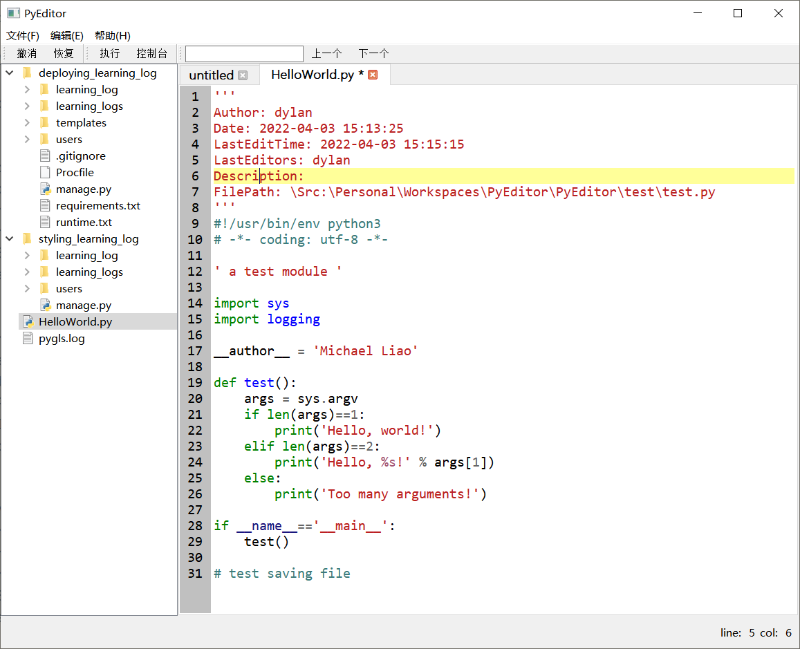

# PyEditor

This is a graduation project of the School of Computer Science, Chengdu University of Information Technology in 2022. 

I do not promise that the code of this project is reliable and it is only for education purposes.



## Running Environment

- Windows 10
- Qt 5.15.2 or higher versions
- Qt 5.15.2 MinGw 64-bit
- Python 3.10.4 or higher versions

## Get Started

1. `git clone git@github.com:DylanLiuH2O/PyEditor.git`
1. Open `PyEditor.pro` using Qt Creator on Windows 10
2. Configure project with Qt 5.15.2 MinGw 64-bit or higher versions
3. Build & Run

**If `lspserver.exe` cannot run on your system, please package `lsp-server/` as `lspserver.exe` manually from its source code and put it in the top-level folder.**

## Directories

```text
PyEditor
│  .gitignore
│  lspserver.exe <---------------- lspserver executable file
│  main.cpp
│  mainwindow.cpp
│  mainwindow.h
│  mainwindow.ui
│  PyEditor.pro <----------------- project file
│  PyEditor.pro.user
│  README.md
│  resources.qrc
│  SettingDialog.cpp
│  SettingDialog.h
│
├─editor
│      CodeEdit.cpp
│      CodeEdit.h
│      LineNumberArea.cpp
│      LineNumberArea.h
│      TabManager.cpp
│      TabManager.h
│
├─fileBrowser
│      FileBrowserSortFilterProxyModel.cpp
│      FileBrowserSortFilterProxyModel.h
│
├─img
│      image-20220529124724239.png
│
├─lsp-cpp
│  │  LICENSE
│  │  lsp-cpp.pri
│  │  README.md
│  │
│  ├─include
│  │      LSP.hpp
│  │      LSPClient.hpp
│  │      LSPUri.hpp
│  │
│  └─third_party
│      └─nlohmann
│              json.hpp
│
├─lsp-server <----------------- source code of lspserver.exe
│  │  entry.py
│  │  server.py
│  │
│  └─styles
│          default.py
│          monokai.py
│
├─lspClient
│      LSPClient.cpp
│      LSPClient.hpp
│
├─resources
│      logo.png
│
├─settings
│      AppearanceSettingPage.cpp
│      AppearanceSettingPage.h
│      EditorSettingPage.cpp
│      EditorSettingPage.h
│      KitsSettingPage.cpp
│      KitsSettingPage.h
│      SettingPage.cpp
│      SettingPage.h
│
├─statusBar
│      CursorInfoWidget.cpp
│      CursorInfoWidget.h
│
├─test
│      123.txt
│      abc.txt
│      cfg.txt
│      ggg.txt
│      myfile.cc
│      pygls.log
│      saveas.cc
│      test.cc
│      test.py
│      test.txt
│
└─utils
        JsonUtil.cpp
        JsonUtil.h
```

